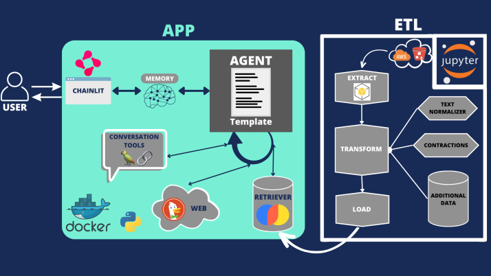

# Financial Advisor Chatbot

### Team members:
+ [Micaela Kortsarz](https://www.linkedin.com/in/micaelakortsarz)
+ [Gonzalo Diez](https://www.linkedin.com/in/gonzalo-damian-diez)
+ [Leandro Carrizo](https://www.linkedin.com/in/leandro-carrizo)
+ [Gabriela Apud](https://www.linkedin.com/in/mariagabrielaapud)

### Mentor:
+ [Ana Maria Lopez](https://www.linkedin.com/in/amlopez81)

## Table of Contents
- [Goals](#goals)
- [Overview](#overview)
- [Key Features](#keyfeatures)
- [Data Sources](#data)
- [Exploratory Data Analysis (EDA)](#eda)
- [System Architecture](#system-architecture)
- [Prerequisites](#prerequisites)
- [Setup & Installation](#setup--installation)
- [Detailed Modules Description](#detailed-modules-description)
- [Usage & Interactions](#usage--interactions)
- [Resources](#resources)

## Goals
The primary aim of this project is to create a user-friendly platform that facilitates interactions with a Chatbot assistant, enabling users to inquire about financial aspects concerning NASDAQ companies. To achieve this, we will commence by extracting all text data from the given dataset and storing it in a suitable platform, like Choma. This storage will enable efficient text searches to retrieve responses matching the user's queries. Subsequently, we will integrate ChatGPT, to synthesize comprehensive answers for the user based on the retrieved text snippets. The implementation will include a user-friendly chat interface and an API to facilitate seamless communication between the UI and the model. The UI was designed using Chainlit.

## Overview
The Financial Advisor Chatbot is a state-of-the-art solution designed to facilitate users in obtaining insightful financial information regarding NASDAQ-listed companies. The chatbot employs cutting-edge technologies and methodologies, including Deepset Haystack, LangChain, OpenAI GPT models, and advanced natural language processing techniques.

Designed with a focus on real-time performance, the Financial Advisor Chatbot aims to:
- Provide instantaneous, accurate, and user-friendly interactions.
- Seamlessly handle vast amounts of financial data.
- Employ advanced NLP techniques for text extraction, normalization, and response generation.

## Key Features
- *Real-time Interaction*: A responsive chat interface that facilitates user interactions and delivers insightful financial data.
- *Data-Driven Insights*: Leverages a rich dataset of NASDAQ companies, enhanced with additional information sourced through independent internet research.
- *Advanced NLP*: Incorporates state-of-the-art NLP techniques to understand, process, and generate human-like text responses.

## Data Sources
1. *Primary Dataset*: Contains financial documents and reports (~1000) related to NASDAQ-listed companies.
2. *`additional_information.csv`*: A dataset generated by our team after extensive internet research. It aims to enrich the primary dataset by adding contextually relevant information about the companies.

## Exploratory Data Analysis (EDA)
A detailed EDA was performed to understand the dataset's structure and intricacies. This analysis aids in making informed decisions during preprocessing, model selection, and inference. The EDA can be accessed [here](https://colab.research.google.com/drive/1RnUuM39Qgm3U7XpxdoRFg-VaPfIAViMN?usp=sharing).

## System Architecture
We have created a basic microservice architecture with one service containerized with docker and one folder with the extraction, transform and load of the documents (Figure 1):

Figure 1. System architecture. 

## Prerequisites
- Python 3.8+
- Docker & Docker Compose

## Setup & Installation
1. Clone the repository:
   bash
   git clone <repository-url>
   
2. Navigate to the project root and install Python dependencies:
   bash
   pip install -r app/requirements.txt
   pip install -r etl/requirements.txt
   
3. Set environment configurations in a `.env` file.
4. Deploy using Docker:
   bash
   docker-compose up --build
   

## Detailed Modules Description
### App:
- *`main.py`*:
  - *Role*: Primary interface between the user and the backend logic.
  - *Key Features*: Session management, asynchronous communication, error handling.
  - *Technologies*: The UI was designed using Chainlit.
- *`agent.py`*:
  - *Role*: Central decision-making entity, responsible for orchestrating responses.
  - *Technologies*: Integration with AzureChatOpenAI, structured prompts and dynamic response generation with langchain.
### ETL:
- *`download.py`*:
  - *Role*: Seamless and efficient data acquisition from AWS S3.
  - *Features*: Batch downloading, error recovery, and logging.
- *`text_normalizer.py`*:
  - *Role*: Text preprocessing and normalization.
  - *Techniques*: Stemming, lemmatization, contraction expansion, special character removal, and more.
- *`contractions.py`*:
  - *Role*: Utility module for contraction mapping.
- *`data_split.py`*:
  - *Role*: Data extraction from PDFs and content segmentation, metadata extraction.
  - *Technologies*: Haystack for PDF processing, advanced text chunking algorithms.
- *`load.py`*:
  - *Role*: Data loading and transformation.
  - *Technologies*: `Chroma` database for efficient storage and retrieval.
  - *Features*: Embeddings generation, loading to vectorstore database.
  - *Embedding*: We chose 'multi-qa-MiniLM-L6-cos-v1' for being the best in terms of performance/size ratio. [source](https://www.sbert.net/docs/pretrained_models.html)

### ETL Integration and Chroma Database Generation

The etl.ipynb notebook serves as the central hub for integrating the functionalities of the ETL (Extract, Transform, Load) module. It encapsulates the diverse features of the ETL process, ensuring seamless data preparation for the Financial Advisor Chatbot application.

The most significant contribution of etl.ipynb is its role in generating the Chroma database used by the chatbot app. The Chroma database is a foundational component that enables efficient document retrieval and text-based interactions. It contains the preprocessed and structured textual content of financial documents, making it a critical asset for the chatbot's real-time responses.

For demo purposes, we have configured etl.ipynb to work with a subset of 3 documents. However, please note that the functionality extends to working with a larger number of documents (we used 1000). By adjusting the n_documents variable within the notebook, users can tailor the scope of the Chroma database according to their requirements.

## Usage & Interactions
- Access the chatbot via the web interface (the default port defined in Docker is 8000).
- Pose questions related to NASDAQ companies.
- Interact with the chatbot in real-time, obtaining insightful responses.
- Integration with real-time financial news sources.

# Resources
- [Lil'Log: How to Build an Open-Domain Question Answering System?](https://lilianweng.github.io/posts/2020-10-29-odqa/)
- [Haystack Tutorial: Build Your First Question Answering System](https://haystack.deepset.ai/tutorials/01_basic_qa_pipeline)
- [Haystack Tutorial: Build a Scalable Question Answering System](https://haystack.deepset.ai/tutorials/03_scalable_qa_system)
- [Haystack Tutorial: Preprocessing Your Documents](https://haystack.deepset.ai/tutorials/08_preprocessing)
- [Haystack Tutorial: Generative QA with Retrieval-Augmented Generation](https://haystack.deepset.ai/tutorials/07_rag_generator)
- [OpenAI API](https://openai.com/blog/openai-api)
- [Papers with code: "Generative Question Answering"](https://paperswithcode.com/task/generative-question-answering/codeless)
- [ReAct: Synergizing Reasoning and Acting in Language Models](https://ai.googleblog.com/2022/11/react-synergizing-reasoning-and-acting.html)
- [Conversation Agent (for Chat Models) in LangChain](https://python.langchain.com/en/latest/modules/agents/agents/examples/chat_conversation_agent.html)
- [AI Agents tutorial: How to create information retrieval Chatbot](https://lablab.ai/t/agents-retrieval-chatbot)
- [Chainlit Documentation](https://docs.chainlit.io/overview)
